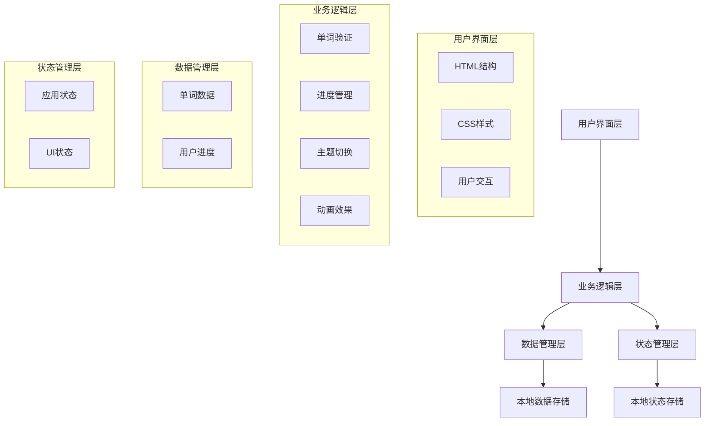

# MorphoMaster - 英语形态变化学习大师 🎓

## 项目概述 📖

MorphoMaster是一款专注于英语不规则动词和名词复数形式学习的交互式Web应用。通过简洁直观的界面设计和智能化的学习体验，帮助用户高效掌握英语单词的各种形态变化，是英语学习者的理想助手。


## 项目背景与痛点 🎯

### 现有问题

- 英语不规则动词和名词复数形式是英语学习中的难点
- 传统学习方式枯燥乏味，缺乏互动性
- 现有学习应用功能单一，缺乏个性化学习体验
- 学习进度难以追踪，学习效果难以量化

### 解决方案

MorphoMaster通过以下创新设计解决上述问题：

- 🎮 游戏化学习体验，提高学习兴趣
- 📊 智能进度追踪系统，量化学习效果
- 🌓 个性化主题切换，适应不同学习环境
- 🎯 精准错误反馈，针对性强化记忆
- ⌨️ 快捷键支持，提升操作效率

## 技术架构 🏗️

### 整体架构图



### 技术栈选型

| 技术 | 版本 | 用途 | 选择理由 |
|------|------|------|----------|
| HTML5 | - | 页面结构 | 语义化标签，良好的SEO支持 |
| CSS3 | - | 样式设计 | 支持CSS变量、动画、响应式设计 |
| JavaScript | ES6+ | 核心逻辑 | 模块化开发，现代语法特性 |
| JSON | - | 数据存储 | 轻量级数据交换格式 |
| LocalStorage | - | 本地存储 | 无需服务器，持久化用户数据 |

## 核心功能模块 🧩

### 1. 单词学习模块 📚

#### 功能特点

- 支持不规则动词和名词复数两种学习模式
- 提供国际音标(IPA)和中文释义
- 智能输入验证，实时反馈学习结果
- 错误答案高亮显示，正确答案即时展示

#### 技术实现

```javascript
// 验证逻辑示例
export function validateVerb(currentWord) {
  let hasError = false
  let resultHTML = ''

  const checkInput = (input, correctVal, correctIPA) => {
    const normalized = normalizeInput(input.value)
    const isCorrect = normalized === correctVal

    input.classList.remove('correct', 'incorrect')
    input.classList.add(isCorrect ? 'correct' : 'incorrect')

    if (!isCorrect) {
      resultHTML += `${correctVal} ${correctIPA}<br>`
      input.select()
      hasError = true
    }
  }

  checkInput(state.domElements.pastInput, currentWord.past, currentWord.pastIPA)
  checkInput(
    state.domElements.pastParticipleInput,
    currentWord.pastParticiple,
    currentWord.pastParticipleIPA
  )

  state.domElements.result.innerHTML = resultHTML
  return !hasError
}
```

### 2. 进度管理模块 📈

#### 功能特点

- 实时学习进度可视化展示
- 本地存储学习进度，支持断点续学
- 智能按钮状态控制，优化用户体验
- 学习完成庆祝动画，增强成就感

#### 技术实现

```javascript
// 进度管理核心代码
export function saveProgress() {
  try {
    const progress = calculateProgress()
    localStorage.setItem(
      'progress',
      JSON.stringify({
        currentIndex: state.currentWordIndex,
        progressBarWidth: progress,
      })
    )
  } catch (error) {
    console.error('保存进度失败:', error)
    alert('无法保存进度，请检查浏览器设置。')
  }
}
```

### 3. 主题切换模块 🌓

#### 功能特点

- 支持明暗两种主题模式
- 主题状态本地持久化存储
- 平滑过渡动画效果
- 自适应系统主题设置

#### 技术实现

```css
/* 主题变量定义 */
:root {
  --primary-color: #ffffff;
  --secondary-color: #1a1a2e;
  --accent-color: #e6e6fa;
  /* ...更多变量 */
}

.dark-mode {
  --primary-color: #1a1a2e;
  --secondary-color: #ffffff;
  --accent-color: #2d3748;
  /* ...更多变量 */
}
```

### 4. 交互体验模块 🎮

#### 功能特点

- 键盘快捷键支持，提升操作效率
- 输入框智能焦点管理
- 错误答案抖动动画效果
- 完成学习庆祝动画

#### 快捷键支持

| 快捷键 | 功能 | 说明 |
|--------|------|------|
| Enter | 提交答案 | 验证当前输入 |
| Alt+H | 上一个单词 | 切换到上一个单词 |
| Alt+L | 下一个单词 | 切换到下一个单词 |
| Alt+T | 切换主题 | 明暗主题切换 |

## 创新点分析 💡

### 1. 智能输入验证系统 🧠

传统学习应用通常采用简单的字符串匹配验证，而MorphoMaster实现了智能输入验证系统：

- **输入标准化**：自动处理大小写、特殊字符和多余空格
- **多答案支持**：支持同一单词的多种正确形式（如过去分词的多种形式）
- **即时反馈机制**：错误答案即时高亮，正确答案即时展示

### 2. 模块化架构设计 🧩

项目采用高度模块化的架构设计，每个功能模块职责单一，降低耦合度：

```javascript
// 模块化导入示例
import { checkAnswers } from './modules/answer.js'
import { toggleConfetti } from './modules/confetti.js'
import { setupEnterHandler } from './modules/input.js'
import { nextWord, previousWord } from './modules/navigation.js'
import { updateCurrentWord } from './modules/word.js'
import { loadProgress } from './progress.js'
import { state } from './state.js'
import { initTheme, toggleTheme, initSourceCodeToggle } from './theme.js'
```

### 3. 无服务器本地存储 💾

应用完全基于前端技术，无需服务器支持：

- **单词数据本地存储**：使用JSON格式存储单词数据
- **学习进度持久化**：利用LocalStorage保存用户学习进度
- **主题设置记忆**：记录用户的主题偏好

### 4. 响应式设计与无障碍访问 ♿

- **响应式布局**：适配不同屏幕尺寸的设备
- **键盘导航支持**：完全支持键盘操作，提高可访问性
- **语义化HTML**：使用语义化标签，提高屏幕阅读器兼容性

## 实际应用价值 🌍

### 教育领域应用

1. **自主学习工具**：学生可利用碎片时间进行英语形态变化学习
2. **课堂教学辅助**：教师可作为课堂互动工具，增强教学趣味性
3. **语言培训机构**：可作为培训课程的辅助练习工具

### 技术价值

1. **前端技术实践**：展示了现代前端技术的实际应用
2. **模块化设计范例**：提供了良好的代码组织和架构设计参考
3. **用户体验设计**：体现了以用户为中心的设计理念

## 性能优化 ⚡

### 1. 数据加载优化

- 使用JSON格式存储单词数据，减少解析时间
- 实现数据懒加载，提高初始加载速度

### 2. 渲染性能优化

- 使用DocumentFragment进行DOM操作，减少重排重绘
- CSS动画使用GPU加速，提升动画流畅度

### 3. 内存管理优化

- 及时清理事件监听器，防止内存泄漏
- 合理使用变量作用域，减少内存占用

## 未来发展规划 🚀

### 短期计划（1-3个月）

- [ ] 添加更多单词类型（形容词、副词等）
- [ ] 实现学习统计功能
- [ ] 增加单词收藏功能
- [ ] 优化移动端体验

### 中期计划（3-6个月）

- [ ] 开发多语言支持（法语、德语等）
- [ ] 实现智能复习算法（艾宾浩斯遗忘曲线）
- [ ] 添加语音识别和发音评分功能
- [ ] 开发学习社区和分享功能

### 长期计划（6-12个月）

- [ ] 开发移动应用版本
- [ ] 实现云端数据同步
- [ ] 集成AI智能推荐系统
- [ ] 开发教师管理后台

## 项目亮点总结 ✨

1. **🎯 专注细分领域**：聚焦英语不规则动词和名词复数，做精做深
2. **🎮 游戏化体验**：通过动画、进度条等元素增强学习趣味性
3. **🧠 智能验证系统**：精准的输入验证和即时反馈机制
4. **🌓 个性化体验**：支持主题切换，适应不同使用场景
5. **⌨️ 高效操作**：丰富的快捷键支持，提升操作效率
6. **📱 响应式设计**：适配各种设备，随时随地学习
7. **🔧 模块化架构**：代码结构清晰，易于维护和扩展
8. **💾 离线可用**：无需网络连接，随时随地学习

## 结语 📝

MorphoMaster不仅是一个英语学习工具，更是现代前端技术的实践展示。通过创新的设计理念和精心的技术实现，我们为用户提供了高效、有趣的英语形态变化学习体验。未来，我们将继续优化产品功能，拓展应用场景，致力于打造更优质的语言学习平台。

---

**项目地址**：[GitHub仓库链接]  
**在线体验**：[项目演示链接]  
**技术交流**：[讨论区链接]

*感谢您对MorphoMaster项目的关注与支持！* 🙏
